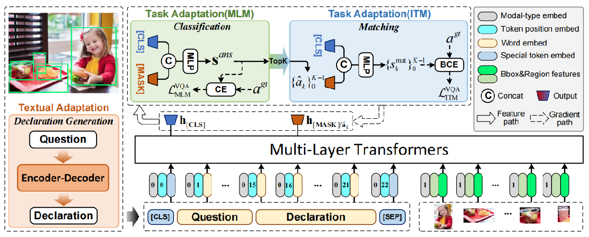

# DiagramQA

Misc   
ssh：Windows自带的CLI SSH Client
winget  ~ wget
Windows Terminal ~ bash，PowerShell
PuTTY：SSH Shell，包括scp，sftp client。
choco：Windows的Chocolatey包管理工具，类似于Python的pip命令，Ubuntu下的apt-get

### Geometric Diagram QA
大致分为2步：1）将题干和几何示意图转换为形式描述。2）通过演绎推理，得到问题的答案。  
难点1：当示意图不符合比例时，题干与示意图的互补增强。  
难点2：演绎推理过程中的辅助线的做法及匹配的演绎推理。

## 相关研究VQA

### CVPR22

* SimVQA: Exploring Simulated Environments for Visual Question Answering
* A Thousand Words Are Worth More Than a Picture: Natural Language-Centric Outside-Knowledge Visual Question Answering
* SwapMix: Diagnosing and Regularizing the Over-reliance on Visual Context in Visual Question Answering
* Dual-Key Multimodal Backdoors for Visual Question Answering （后门程序）
* MuKEA: Multimodal Knowledge Extraction and Accumulation for Knowledge-based Visual Question Answering
* Maintaining Reasoning Consistency in Compositional Visual Question Answering
* 
* LaTr: Layout-Aware Transformer for Scene-Text VQA
* 
* Visual Abductive Reasoning
* VisualHow: Multimodal Problem Solving
* 
* Pseudo-Q: Generating Pseudo Language Queries for Visual Grounding
* Grounding Answers for Visual Questions Asked by Visually Impaired People
* 
* Episodic Memory Question Answering（未下载到）

### ACL22
* Hypergraph Transformer: Weakly-Supervised Multi-hop Reasoning for Knowledge-based Visual Question Answering. ACL22
* DuReader_vis: A Chinese Dataset for Open-domain Document Visual Question Answering
* xGQA: Cross-Lingual Visual Question Answering
* 
* CARETS: A Consistency And Robustness Evaluative Test Suite for VQA
* CLIP Models are Few-Shot Learners: Empirical Studies on VQA and Visual Entailment
* Co-VQA : Answering by Interactive Sub Question Sequence
* 
* ChartQA: A Benchmark for Question Answering about Charts with Visual and Logical Reasoning
* Multilevel Hierarchical Network with Multiscale Sampling for Video Question Answering

### AAAI22
* Dynamic Key-Value Memory Enhanced Multi-Step Graph Reasoning for Knowledge-Based Visual Question Answering
*  
* MuMuQA: Multimedia Multi-Hop News Question Answering via Cross-Media Knowledge Extraction and  Grounding
* 
* An Empirical Study of GPT-3 for Few-Shot Knowledge-Based VQA
* Multi-Modal Answer Validation for Knowledge-Based VQA
* 
* Learning the Dynamics of Visual Relational Reasoning via Reinforced Path Routing AAAI2022
* 
* 
*  TempoQR: Temporal Question Reasoning over Knowledge Graphs
* 
* Generation-Focused Table-Based Intermediate Pre-Training for Free-Form Question Answering
* 
* Video as Conditional Graph Hierarchy for Multi-Granular Question Answering

### IJCAI22
* Declaration-based Prompt Tuning for Visual Question Answering   https://github.com/weibifan/eval_DPT  
所使用的VinVL并没有在HuggingFace网站中。   

* Multilevel Hierarchical Network with Multiscale Sampling for Video Question Answering
* 
